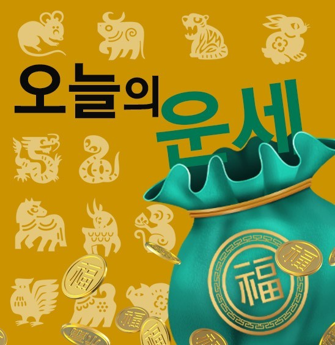
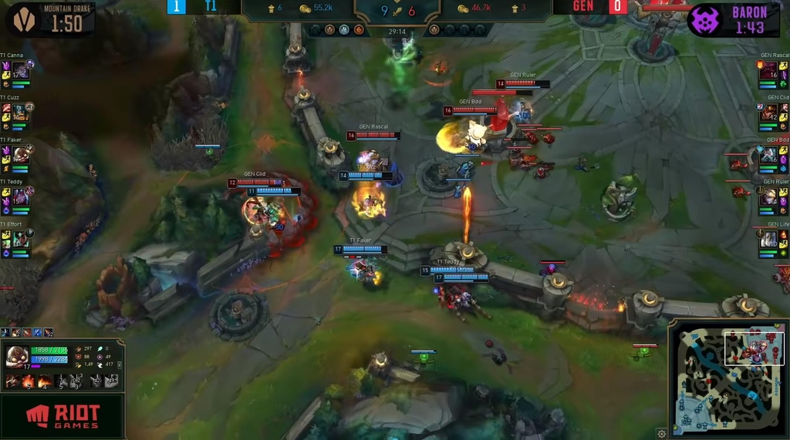
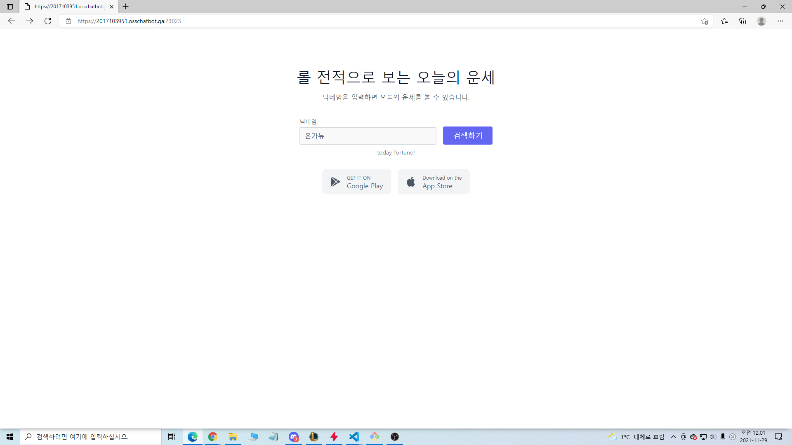
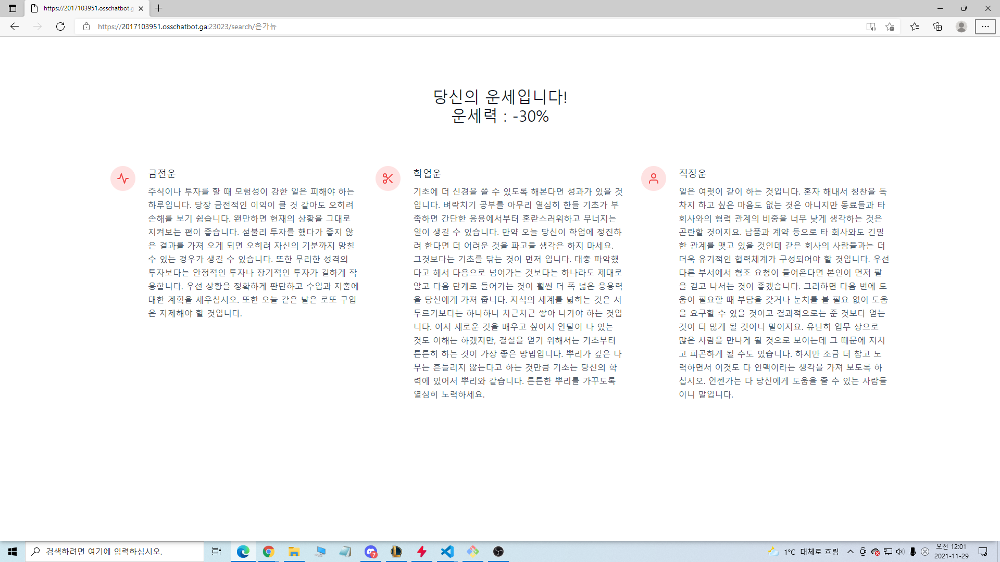
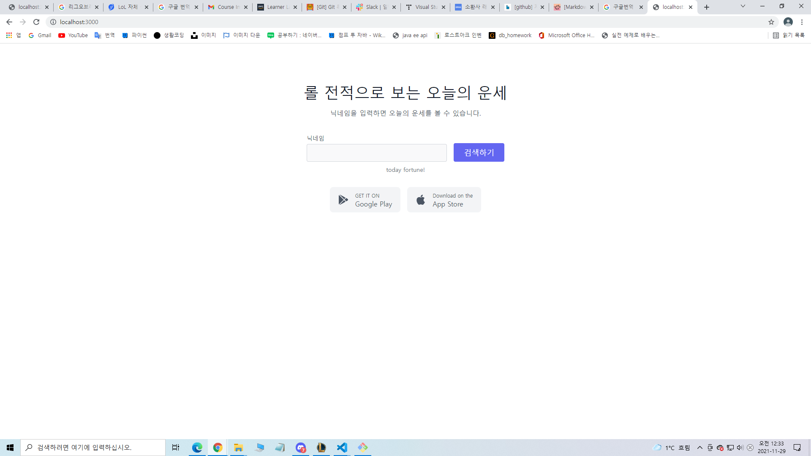

<div id="top"></div>


<!-- PROJECT LOGO -->
<br />
<div align="center">
  <a href="http://khuhub.khu.ac.kr/2017103951/today_fortune">
    
  </a>

  <h3 align="center">롤 전적으로 보는 오늘의 운세!</h3>

  <p align="center">
    오늘의 운세를 확인해 보세요!!
    <br />
    <a href="http://khuhub.khu.ac.kr/2017103951/today_fortune"><strong>Explore the docs »</strong></a>
    <br />
    <br />
    <a href="http://khuhub.khu.ac.kr/2017103951/today_fortune/issues">Report Bug</a>
    ·
    <a href="http://khuhub.khu.ac.kr/2017103951/today_fortune/issues">Request Feature</a>
  </p>
</div>


<!-- TABLE OF CONTENTS -->
<details>
  <summary>Table of Contents</summary>
  <ol>
    <li>
      <a href="#about-the-project">About The Project</a>
      <ul>
        <li><a href="#built-with">Built With</a></li>
      </ul>
    </li>
    <li>
      <a href="#getting-started">Getting Started</a>
      <ul>
        <li><a href="#prerequisites">Prerequisites</a></li>
        <li><a href="#installation">Installation</a></li>
      </ul>
    </li>
    <li><a href="#usage">Usage</a></li>
    <li><a href="#roadmap">Roadmap</a></li>
    <li><a href="#contributing">Contributing</a></li>
    <li><a href="#license">License</a></li>
    <li><a href="#contact">Contact</a></li>
    <li><a href="#acknowledgments">Acknowledgments</a></li>
  </ol>
</details>


<!-- ABOUT THE PROJECT -->
## About The Project
<div align="center">
  <a href="http://khuhub.khu.ac.kr/2017103951/today_fortune">
    
  </a>
</div>


전 세계적으로 인기를 얻고 있고 수십만명의 플레이어들이 즐기는 게임 바로 lol입니다. lol은 '팀운'이라는 것을 가지고 있는데 이것으로 오늘의 운세와 접목 시켜 오늘의 운세를 나름 팀운에 근거해서(물론 신빙성은 없습니다.) 알려주는 사이트를 만들어 보고자 했습니다.


Here's why:
* 생년월일로만 보는 운세사이트
* 참신한 운세 사이트 :smile:


많은 운세 사이트들이 있지만 대부분 생년월일을 가지고 하지만 이 사이트는 실제 당신의 롤 전적의 의거하여 정말 과학적인 방법으로 당신의 운을 측정하고 있습니다. 자신의 골드 수급량, 팀의 골드 수급량, 적팀의 골드 수급량, 자신의 kda, 팀의 kda, 적의 kda, 나의 kda를 근거하여 금전운, 직장운, 학업운, 운세 점수를 알려주는 유일한 사이트입니다.

롤을 플레이하는 유저라면 오늘의 운세를 받아보세요!!


<p align="right">(<a href="#top">back to top</a>)</p>


### Built With

* [node.js](https://nodejs.org/)
* [tailwindcss](https://tailwindcss.com)

<p align="right">(<a href="#top">back to top</a>)</p>


<!-- GETTING STARTED -->
## Getting Started


로컬에서 프로젝트를 설정하는 방법.
로컬 복사본을 가져와 실행하려면 다음의 간단한 예제를 따르시면 됩니다.


### Prerequisites


* npm install
  ```


### Installation


설치 및 설정


1. Get a free API Key at [https://developer.riotgames.com](https://developer.riotgames.com)
2. Clone the repo
   ```
   git clone http://khuhub.khu.ac.kr/2017103951/today_fortune.git
   ```
3. Install NPM packages
   ```
   npm install
   ```
4. Enter your API in `main.js`
   ```
   const api_key = 'ENTER YOUR API';
   ```

<p align="right">(<a href="#top">back to top</a>)</p>


<!-- USAGE EXAMPLES -->
## Usage

~~~js
//AWS 사용시
const domain = "ENTER YOUR API" // 자신의 도메인 입력

try {
    const option = {
      ca: fs.readFileSync('/etc/letsencrypt/live/' + domain +'/fullchain.pem'),
      key: fs.readFileSync(path.resolve(process.cwd(), '/etc/letsencrypt/live/' + domain +'/privkey.pem'), 'utf8').toString(),
      cert: fs.readFileSync(path.resolve(process.cwd(), '/etc/letsencrypt/live/' + domain +'/cert.pem'), 'utf8').toString(),
    };
  
    HTTPS.createServer(option, app).listen(sslport, () => {
      console.log(`[HTTPS] Server is started on port ${sslport}`);
    });
  } catch (error) {
    console.log('[HTTPS] HTTPS 오류가 발생하였습니다. HTTPS 서버는 실행되지 않습니다.');
    console.log(error);
} // -> 이 부분을 활성화 후


app.listen(3000, () => {
    console.log('listening on port 3000');
}) // -> 이 부분은 local 사용시 사용. 위 코드 사용시 주석 처리

~~~

실행화면(AWS 활용)

<a href="http://khuhub.khu.ac.kr/2017103951/today_fortune">
    
</a>


<a href="http://khuhub.khu.ac.kr/2017103951/today_fortune">
    
</a>


---------


LOCAL에서 실행화면

<a href="http://khuhub.khu.ac.kr/2017103951/today_fortune">
    
</a>


<p align="right">(<a href="#top">back to top</a>)</p>


<!-- CONTRIBUTING -->
## Contributing

이 프로젝트를 개선할 제안이 있으면 저장소를 fork하고 pull request를 생성해주세요. Thank you!

1. Fork the Project
2. Create your Feature Branch 
3. Commit your Changes 
4. Push to the Branch 
5. Open a Pull Request

<p align="right">(<a href="#top">back to top</a>)</p>


<!-- LICENSE -->
## License

None

<p align="right">(<a href="#top">back to top</a>)</p>


